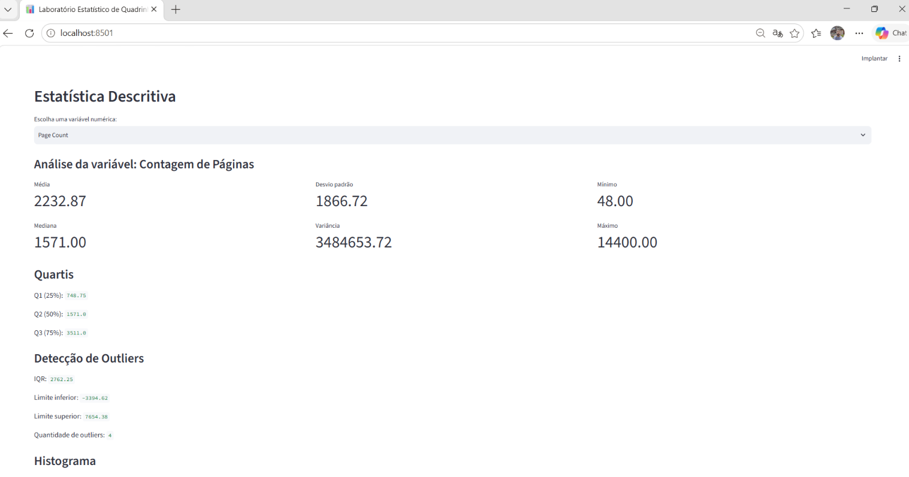
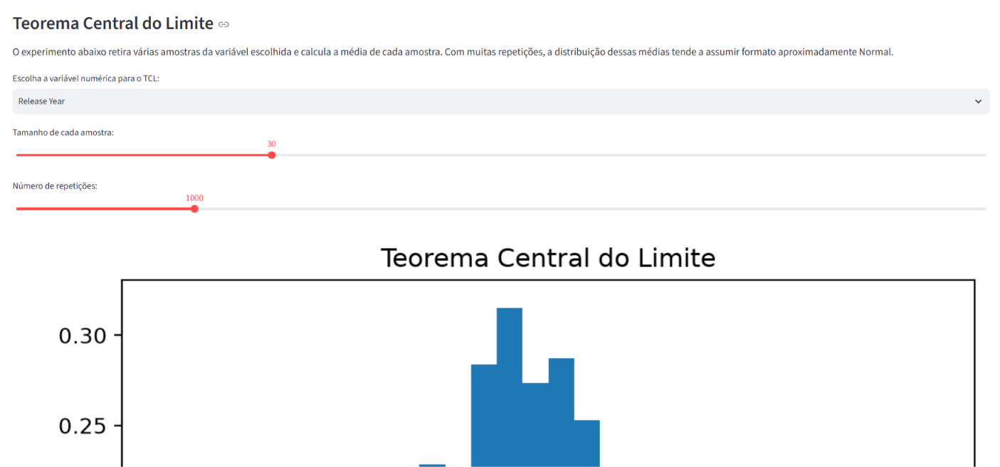
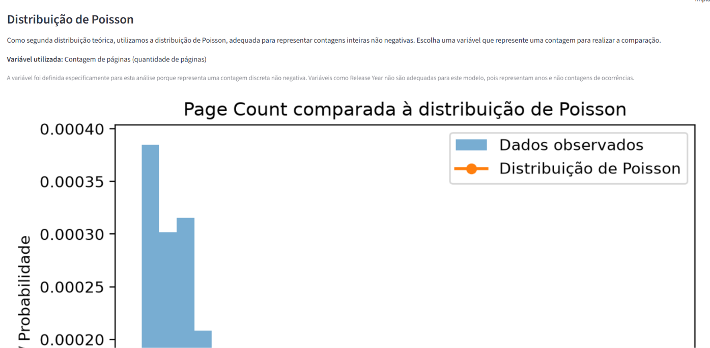
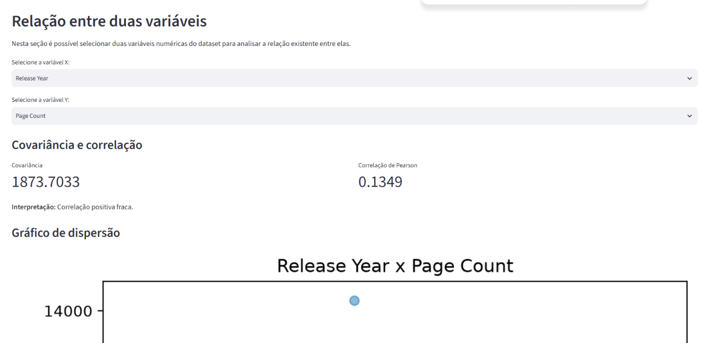

# Laboratório Estatístico de Quadrinhos

## Sobre o projeto

Este projeto foi desenvolvido para a disciplina de Matemática e Estatística para Computação do curso de Ciência da Computação.

O objetivo é desenvolver um laboratório estatístico interativo utilizando Python, permitindo analisar um conjunto de dados real sobre histórias em quadrinhos.

A aplicação utiliza o Streamlit para criar uma interface interativa e possui uma biblioteca estatística própria, chamada `minhastats.py`, na qual os principais cálculos estatísticos foram implementados sem utilizar funções estatísticas prontas.

## Aluno

**Nome:** Renato Alves Carvalho  
**Matrícula:** 72601667  
**Curso:** Ciência da Computação  
**Modalidade:** Virtual - Campus Virtual  
**Período:** 2º semestre - EAD 2026  

## Dataset

Foi utilizado o dataset **Comic Books Dataset (10,000 entries)**, contendo informações sobre histórias em quadrinhos.

O conjunto utilizado possui:

- 10.000 registros
- 17 variáveis
- variáveis numéricas e categóricas relacionadas às obras

Fonte original:

https://www.kaggle.com/datasets/rudrakumargupta/comic-books-dataset-10000-entries

Arquivo utilizado no projeto:

`comic_books_10000_dataset.csv`

## Funcionalidades

O laboratório foi dividido em módulos de análise estatística.

### Estatística descritiva

Permite selecionar variáveis do dataset e calcular medidas como:

- média
- mediana
- moda
- amplitude
- variância
- desvio padrão
- quartis
- percentis
- coeficiente de variação

Também são apresentados gráficos e identificação de possíveis outliers utilizando a regra do IQR.

### Probabilidade e simulação

O projeto possui experimentos de Monte Carlo para demonstrar:

- Lei dos Grandes Números
- Teorema Central do Limite

O usuário pode alterar parâmetros das simulações e observar o comportamento dos resultados.

### Distribuições teóricas

Os dados são comparados visualmente com distribuições probabilísticas teóricas.

Foram utilizadas:

- Distribuição Normal
- Distribuição de Poisson

Os parâmetros são estimados a partir dos próprios dados e os gráficos permitem avaliar visualmente a qualidade do ajuste.

### Correlação e regressão linear

O usuário pode escolher duas variáveis numéricas para realizar:

- cálculo da covariância
- correlação de Pearson
- diagrama de dispersão
- regressão linear simples
- cálculo da equação da reta
- cálculo do R²
- predição interativa

Os cálculos principais são realizados pelas funções desenvolvidas no módulo `minhastats.py`.

### Relatório de descobertas

A aplicação apresenta três descobertas obtidas durante a análise do dataset:

1. Os lançamentos estão mais concentrados nos anos recentes.
2. O ano de lançamento possui relação linear fraca com a quantidade de páginas.
3. A quantidade de páginas apresenta grande dispersão, e a distribuição de Poisson apresentou baixo ajuste aos dados observados.

## Biblioteca estatística própria

O arquivo `minhastats.py` contém implementações próprias das principais funções utilizadas no projeto.

Entre elas:

- média
- mediana
- moda
- amplitude
- variância populacional
- variância amostral
- desvio padrão populacional
- desvio padrão amostral
- percentis
- quartis
- coeficiente de variação
- covariância
- correlação de Pearson
- regressão linear
- predição

## Validação dos cálculos

O arquivo `test_minhastats.py` realiza testes automatizados comparando os resultados da biblioteca própria com funções de referência do Python e do NumPy.

Foi utilizada tolerância numérica de:

`1e-9`

Os testes verificam os cálculos estatísticos e os resultados da regressão linear.

## Tecnologias utilizadas

- Python
- Streamlit
- Pandas
- NumPy
- Matplotlib

## Instalação

Com o Python instalado, abra o terminal na pasta do projeto e instale as dependências:

```bash
pip install -r requirements.txt
```

## Executando a aplicação

No terminal, dentro da pasta do projeto, execute:

```bash
python -m streamlit run app.py
```

O Streamlit deverá abrir a aplicação no navegador.

Caso isso não aconteça automaticamente, acesse:

`http://localhost:8501`

## Executando os testes

Para executar os testes automatizados:

```bash
python test_minhastats.py
```

Ao final, se todos os cálculos estiverem corretos, será exibida a mensagem:

`TODOS OS TESTES FORAM CONCLUÍDOS COM SUCESSO`

## Estrutura principal do projeto

```text
laboratorio_quadrinhos/
│
├── app.py
├── minhastats.py
├── test_minhastats.py
├── comic_books_10000_dataset.csv
├── requirements.txt
└── README.md
```

## Capturas da aplicação

A seguir são apresentadas algumas telas do Laboratório Estatístico de Quadrinhos em funcionamento.

### Estatística descritiva

A aplicação permite selecionar uma variável numérica e visualizar medidas estatísticas, quartis e possíveis outliers.



### Teorema Central do Limite

A simulação permite selecionar uma variável do dataset, definir o tamanho das amostras e o número de repetições, observando a distribuição das médias amostrais.



### Distribuição de Poisson

A variável Page Count foi comparada com uma distribuição teórica de Poisson, permitindo avaliar visualmente a qualidade do ajuste.



### Correlação e regressão linear

A aplicação permite selecionar duas variáveis numéricas para analisar covariância, correlação de Pearson, gráfico de dispersão e regressão linear.



## Observação

Correlação estatística não implica causalidade. As relações encontradas neste projeto descrevem o comportamento das variáveis presentes no conjunto de dados analisado e não devem ser interpretadas automaticamente como relações de causa e efeito.